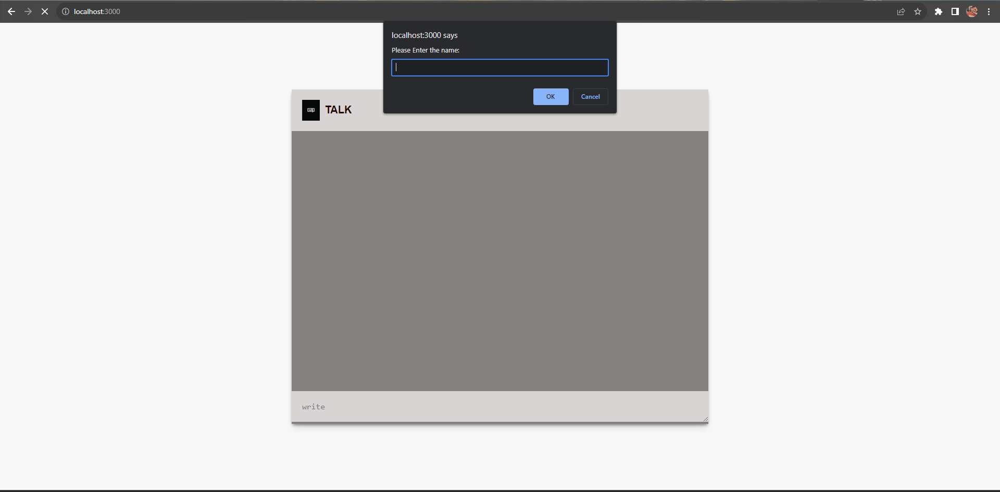

# Socket.IO Chat Application



This is a simple real-time chat application built using Socket.IO. It allows users to join different chat rooms and exchange messages instantly with other participants in the same room.


## Features

- Real-time messaging: Users can send and receive messages in real-time without the need to refresh the page.
- Multiple chat rooms: Users can join and switch between different chat rooms.
- Username selection: Users can choose their desired username before joining the chat.


## Technologies Used

- HTML, CSS, JavaScript
- Node.js
- Express.js
- Socket.IO

## Getting Started

To run the chat application locally, follow these steps:

1. Clone the repository:

```bash
git clone https://github.com/mesiddhantcodes/socket-io-chat-app.git
